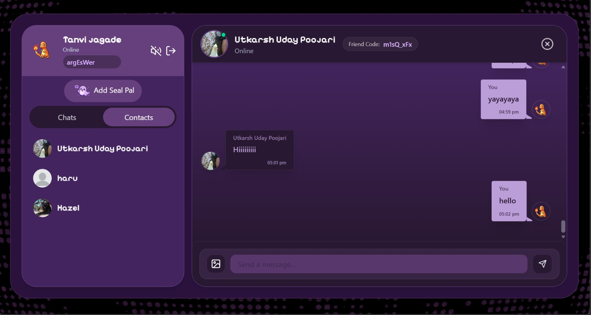
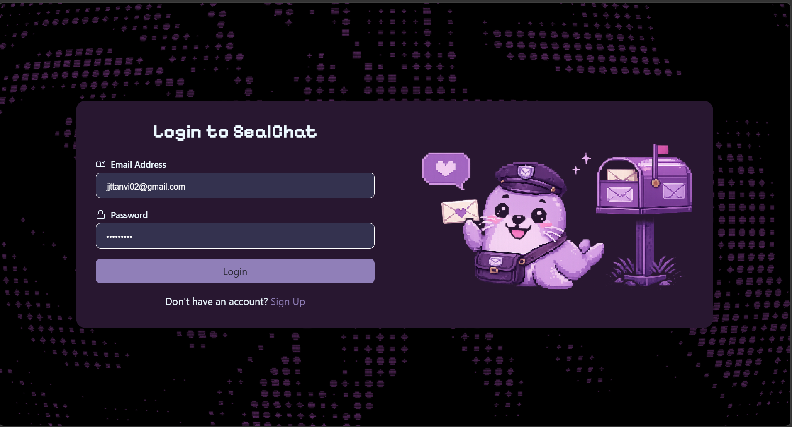
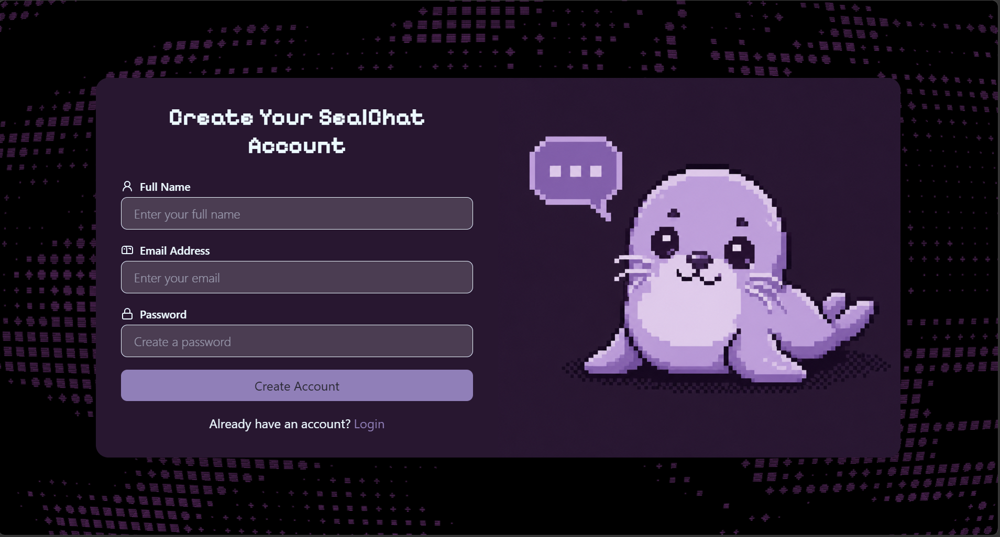
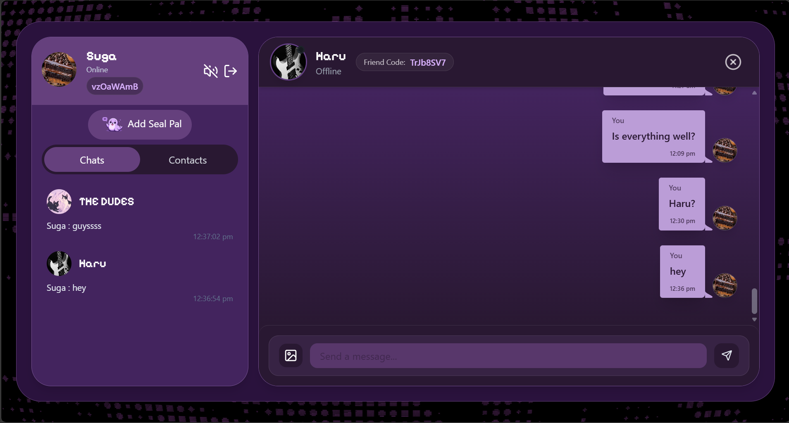
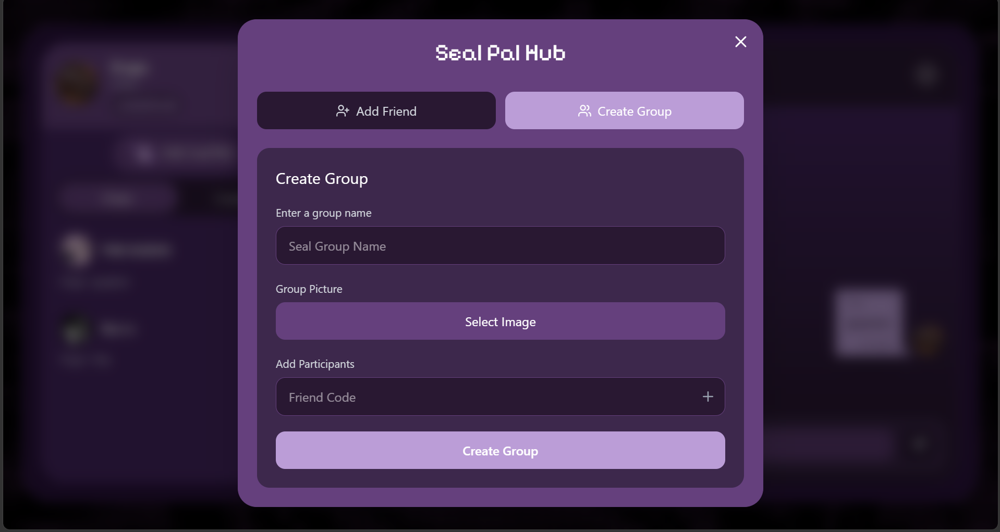
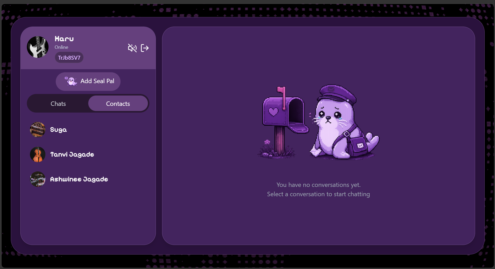
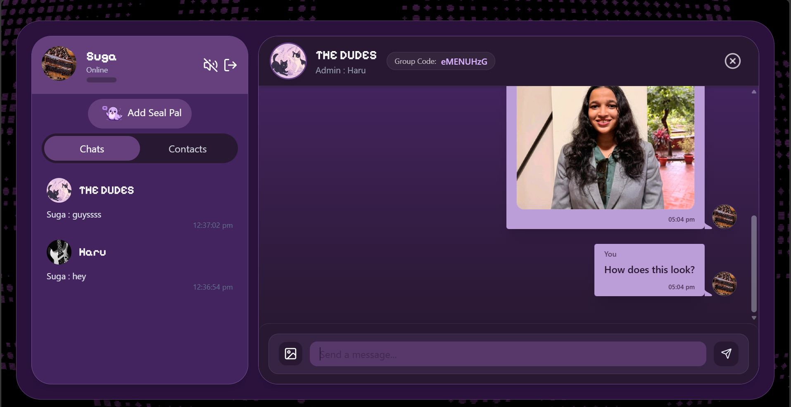
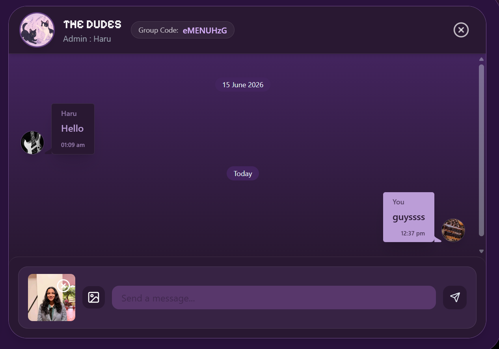
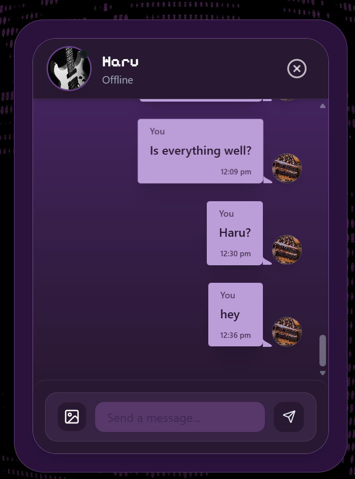
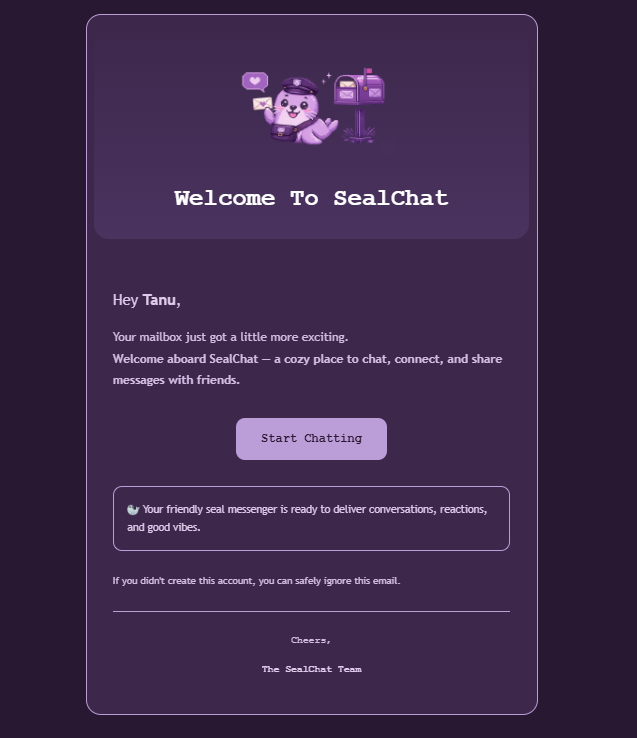

# 🦭 SealPal Chat App

<p align="center">
  
</p>


A real-time full-stack chat application with support for direct messages, group chats, image sharing, and a distinctly over-the-top glitchy terminal aesthetic. Built with React on the frontend and Node.js/Express on the backend, using Socket.io for live messaging.

LIVE AT : https://seal-chat.onrender.com/
---

## Features

- **Authentication** — Signup/login with JWT stored in HTTP-only cookies. Welcome email sent on registration.
- **Friend system** — Add contacts via unique 8-character friend codes (no email lookup needed).
- **Direct messages** — 1-on-1 chat with real-time delivery via Socket.io.
- **Group chats** — Create groups with multiple participants, invite via group code, manage members (add/remove).
- **Image sharing** — Send images uploaded to Cloudinary.
- **Online presence** — Live online/offline status tracked per socket connection.
- **Cursor-based pagination** — Messages load in pages of 50 for performance.
- **Rate limiting & bot protection** — Arcjet shields the backend with a sliding window rate limit (100 req/min) and bot detection.
- **Welcome emails** — Nodemailer sends a welcome email on signup.
- **Keyboard sound effects** — Typing sounds because why not.
- **Faulty terminal background** — An animated, glitchy CRT-style background effect on every page.

---

## Tech Stack

### Backend
| | |
|---|---|
| Runtime | Node.js (ESM) |
| Framework | Express 5 |
| Database | MongoDB via Mongoose |
| Real-time | Socket.io |
| Auth | JWT + bcrypt |
| File uploads | Cloudinary |
| Email | Nodemailer |
| Security | Arcjet (rate limiting, bot detection, shield) |
| IDs | nanoid |

### Frontend
| | |
|---|---|
| Framework | React 19 + Vite |
| Routing | React Router 7 |
| State | Zustand |
| HTTP | Axios |
| UI | Tailwind CSS + DaisyUI |
| Real-time | Socket.io-client |
| Dates | date-fns |
| Icons | Lucide React |

---

## Project Structure

```
CHAT_APP/
├── backend/
│   └── src/
│       ├── controllers/      # auth, message, group logic
│       ├── libs/             # DB, socket, cloudinary, arcjet, env
│       ├── middleware/       # auth, socket auth, validation
│       ├── models/           # User, Message, ChatRoom
│       ├── routes/
│       └── server.js
├── frontend/
│   └── src/
│       ├── assets/           # Images, sounds, FaultyTerminal effect
│       ├── components/
│       ├── hooks/
│       ├── pages/            # ChatPage, Login, SignUp, GroupMemberPage
│       ├── store/            # Zustand stores (auth, chat)
│       └── App.jsx
└── package.json              # Root: build + start scripts
```

---
---

# 📸 Screenshots

## 🔐 Authentication

<p align="center">
  
  
</p>

---

## 💬 Chat Interface

<p align="center">
  
</p>

---

## 👥 Group Chats

<p align="center">
  
  
</p>

---

## 🖼️ Image Sharing

<p align="center">
  
  
</p>

---

## 📱 Responsive Design

<p align="center">
  
</p>

---

## 📧 Welcome Email

<p align="center">
  
</p>

## Getting Started

### Prerequisites

- Node.js 18+
- A MongoDB database (Atlas or local)
- A Cloudinary account
- An Arcjet account
- An email account for Nodemailer (e.g. Gmail with an app password)

### Environment Variables

Copy `.env.example` to `backend/.env` and fill in your values:

```bash
cp .env.example backend/.env
```

### Install & Run (Development)

```bash
# Install backend deps
cd backend && npm install

# Install frontend deps
cd ../frontend && npm install

# Run backend (from backend/)
npm run dev

# Run frontend (from frontend/)
npm run dev
```

Frontend runs on `http://localhost:5173`, backend on `http://localhost:5000`.

### Production Build

From the project root:

```bash
npm run build   # Installs deps and builds frontend
npm start       # Starts the backend, which serves the built frontend
```

---

## API Overview

All routes are prefixed with `/chat`.

| Method | Path | Description |
|---|---|---|
| POST | `/auth/signup` | Register a new user |
| POST | `/auth/login` | Login |
| POST | `/auth/logout` | Logout |
| PUT | `/auth/update-profile` | Update profile picture |
| GET | `/message/contacts` | Get contacts list |
| POST | `/message/add-contact` | Add contact by friend code |
| GET | `/message/chats` | Get all chats with last message |
| POST | `/message/group` | Create a group chat |
| GET | `/message/:chatId` | Get messages (paginated) |
| POST | `/message/send/:chatId` | Send a message |
| GET | `/message/participants/:chatId` | Get group participants |
| POST | `/message/participants/:chatId` | Add participant |
| DELETE | `/message/participants/:chatId` | Remove participant |

---

## License

ISC
